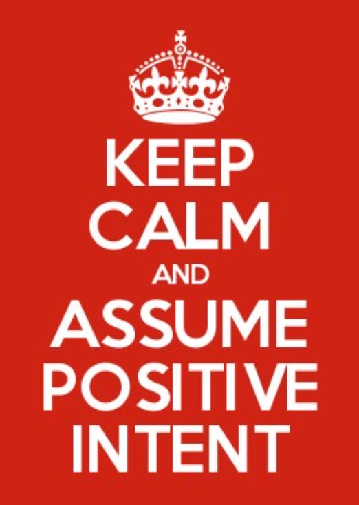

*Don’t Let Worst Possible Stories Win*

If you can count on one thing, it’s that whenever there’s
limited information **people will make up the Worst Possible Story**to fill in the gaps.

* “*My boss hates me!*”
* “*That guy is a #$@%.*”
* “*How can they be so stupid?*”

This dynamic can be especially harmful in newly remote teams,
who have not yet developed patterns of communication that work
for them or in distant working relationships across
organizational silos.

So what can we do about it?

1. **Be as open and transparent as you can**,
   especially around hot button issues.
2. Create as **many opportunities for people to get to know each
   other** better, so that there’s a lot of shared context and
   accumulated goodwill when trouble arises.
3. And most of all: adopt the API (**Assume Positive Intent**) habit for yourself and with your team.

**Who? What? When?**

**When you get angry** about something someone
said, wrote or did. Instead of jumping to
conclusions, **take a deep breath** and **consider the alternatives** by asking:

1. How might this make sense?
2. In what circumstances might this be a reasonable thing to say,
   write or do?
3. Is there any part of this I can agree with?

It might not solve *all* your problems, but
believe me: it can be *transformational* in
many difficult situations.

Try it!

\*
*[Monkeys picture by Aleksey Oryshchenko via Unsplash](https://unsplash.com/@alekseyor)*