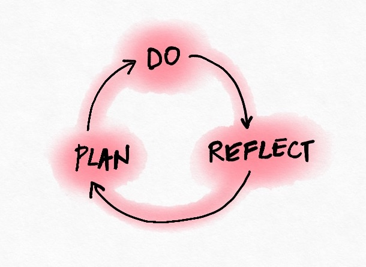
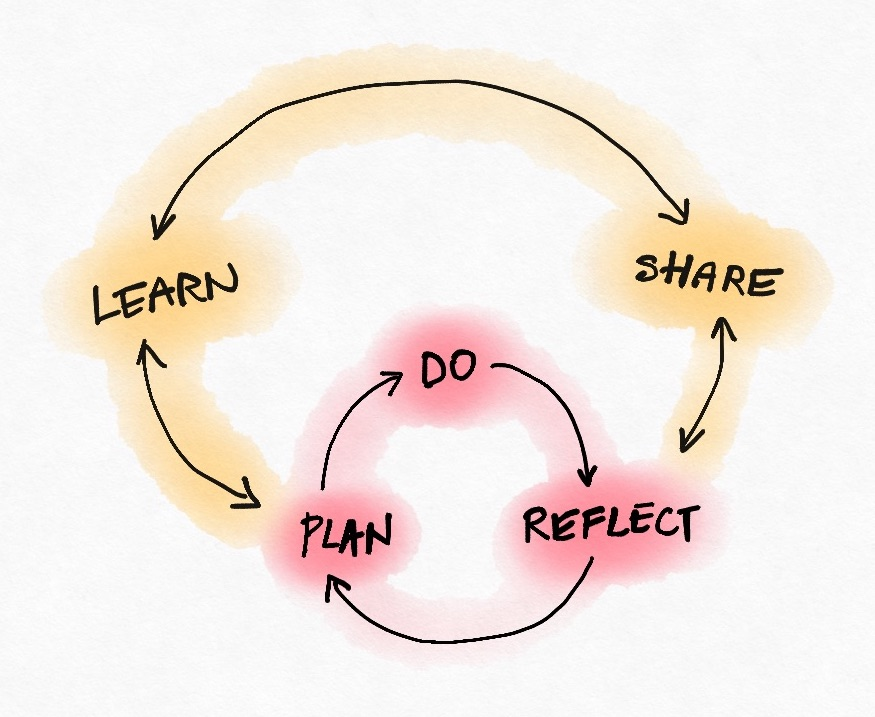
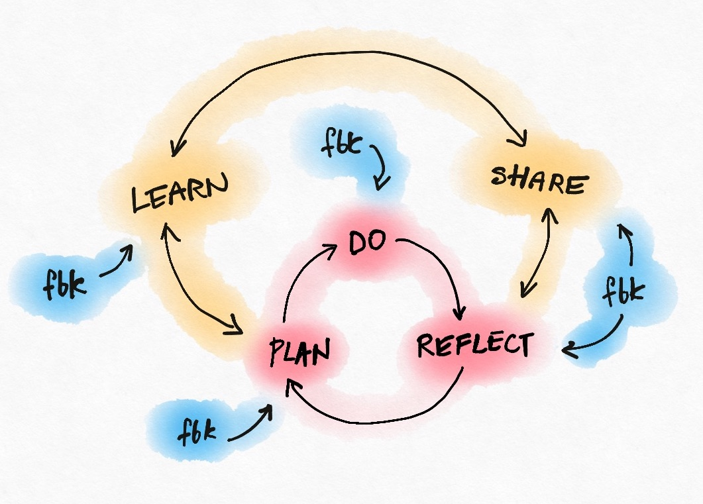

Here’s a powerful framework that can help you lead your
team to greatness.

## Part One: The Setup

1) **Get clear on what matters most** to you, your team, your customers and the
organization you are part of. If you’re unsure: [listen, ask and observe](/blog/meaningful/).

2) **Make the results visible** — there
are many ways including regular customer interactions, all sorts
of reports and dashboards, converations, mini-documentaries,
boards, props, and more.

3) **Make the actions and interactions visible** — invite people to observe your meetings, record
presentations, make automated transcripts, save chat and email
archives, archive commits and code review
comments, exchange ideas in a team wiki or a even a bunch
of shared google docs.

You don’t have to capture EVERYTHING right away (or ever);
start with 2-3 most important results and 2-3 most important
interaction channels.

# Part Two: The Loop

Repeat the following loop. Upgrade it to higher levels when
you can.

## Level 1: Plan, Do, Reflect

Plan, Do, Reflect

### Plan

[Clarify outcomes and actions](/blog/outcome-and-action/)

[If you’re aiming for a far away outcome, focus on the
first step](/blog/how-to-stay-sane-on-the-road-to-meaningful-outcomes/)

### Do

Do what you can, with what you’ve got, every day. No
excuses! \*

### Reflect

I like using the following questions:

1. What’s working well?
2. What’s not working well?
3. What would (likely) work better?

Focus on things you can control more than the things you
can’t.

When reflecting always [start with what’s good](/blog/first-find-the-good/) and look for ways to [turn it up](https://www.youtube.com/watch?v=Y1u6Hzve6rk): repeat, reuse and amplify it. If you can’t find
the good you’re better off not wasting time listing
defects.  
  
For bonus points: bring data.

## Level 2: Learn & Share

At this level add additional learning and inspiration (on
top of the results of your regular reflections).

Whenever you learn something (from outside of from your own
reflections): get into the habit of sharing the key bits as fast
as possible. Write a blog post, give a presentation, at the very
least explain it to someone in a conversation.

This will help you solidify your own knowledge, find gaps you
didn’t know were there and maybe learn something from the
other party in return.

Regular internal meetups, dojos, action learning circles and the
like can be useful for this.

Add learning and sharing

## Level 3: Expert Feedback

If the first two loops are humming along smoothly you are ready
to turbo charge the process by getting targeted feedback on each
important part of your process.

Get that feedback from the best possible source for each element
— that includes the person on your team who’s the
best available expert at some particular discipline, veterans in
other parts of the org or people you bring from outside for this
specific purpose.

Add targeted feedback

## That’s it

Three preparation steps.  
  
Three steps in the main
loop.  
  
Two loop upgrades.  
  
Simple.  
  
See
you in 10000 hours ;)

\* [Thanks to Justyna Pindel for the “do what you
can” quote](https://www.agilebook.club/2020/11/01/everyone-is-a-change-agent-by-april-mills/).  
\*\* [Great team photo by Tobias Mrzyk via Unsplash](https://unsplash.com/@tobiasmrzyk)