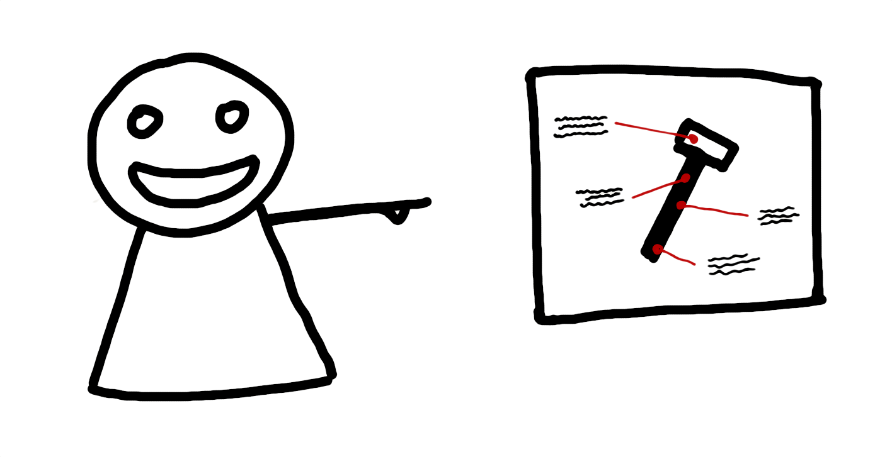

The first ever One Minute Tip for Remote Leaders is about making
references concrete.

When you’re talking about something (document, ticket,
website, app) — share your screen and **show it**.

If you have nothing to show — **create the appropriate item immediately** — capture what you talk about in concise bullet points,
and then make it complete as soon as possible.

If you can’t show it and you can’t create it then be
extra careful, because with ephemeral topics like that
it’s extremely hard to have everyone understand it in the
same way. Ephemeral is the enemy.

What say you?

If you do this: what was the most challenging aspect of
implementing this habit?

If you don’t: why not?

*\*
[Art gallery photo by Mick Haupt via Unsplash](https://unsplash.com/@rocinante_11)*