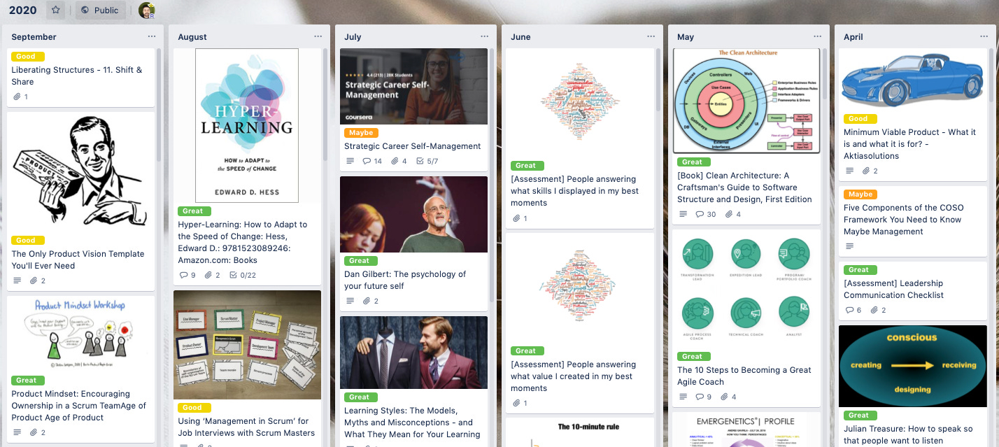

Some people use [Trello](https://trello.com/?ref=localhost) as a [Kanban](https://www.personalkanban.com/personal-kanban-101?ref=localhost) board (i.e. a task management or workflow app) and that’s
a great use for it.

A different way is to think about Trello as a *structured whiteboard* that you can use for online workshops or even
distributed, asynchronous sense-making and problem solving.

Unlike a dedicated task management tool like JIRA, Trello is
much more flexible in how you organize your columns and what you
put in individual cards.

Unlike a dedicated whiteboard tool lika Jamboard, Miro or Mural,
Trello allows for just enough structure that let’s you make
sense of a large amount of items but is also easier to use for
people who are new to it.

For example Trello cards are *individually adressable*. You can link directly to a specific idea that was born during
a big workshop. You don’t have to wade through all the other
stuff that happened there, but it is close by if you do need
some context. A very important trait for integrating the stuff
you do in Trello into the wider context of your team’s
information flows.

Here’s a sneak peek at a part of the board that we used for a
recent workshop about [reducing meeting overload](https://mailchi.mp/ba31a0915319/overload?ref=localhost):

Here’s a board used to collect and share a [catalog of great ideas collected over the whole year](https://trello.com/b/OyCgpp2F/2020?ref=localhost) by [Andrei Gavrila](https://www.linkedin.com/in/gavrilaandrei/?ref=localhost). Notice the amazing *scanability* of the
ideas. I dare you to create a better summary in a regular blog
post or wiki page:

[And finally here’s the article by](https://trello.com/b/OyCgpp2F/2020?ref=localhost)[Paul Klipp](https://www.linkedin.com/in/paulklipp/?ref=localhost) that introduced me to the idea many years ago. It’s a
description of [how to use a Kanban board for remote retrospectives](http://paulklipp.com/blog/use-a-kanban-board-to-facilitate-remote-retrospectives/?ref=localhost).

It uses a different app called Kanbanery, but the same ideas can
be easily used in Trello. Thanks Paul!

\*
[*Blackboard photo by Jason Leung via Unsplash*](https://unsplash.com/@ninjason?ref=localhost)